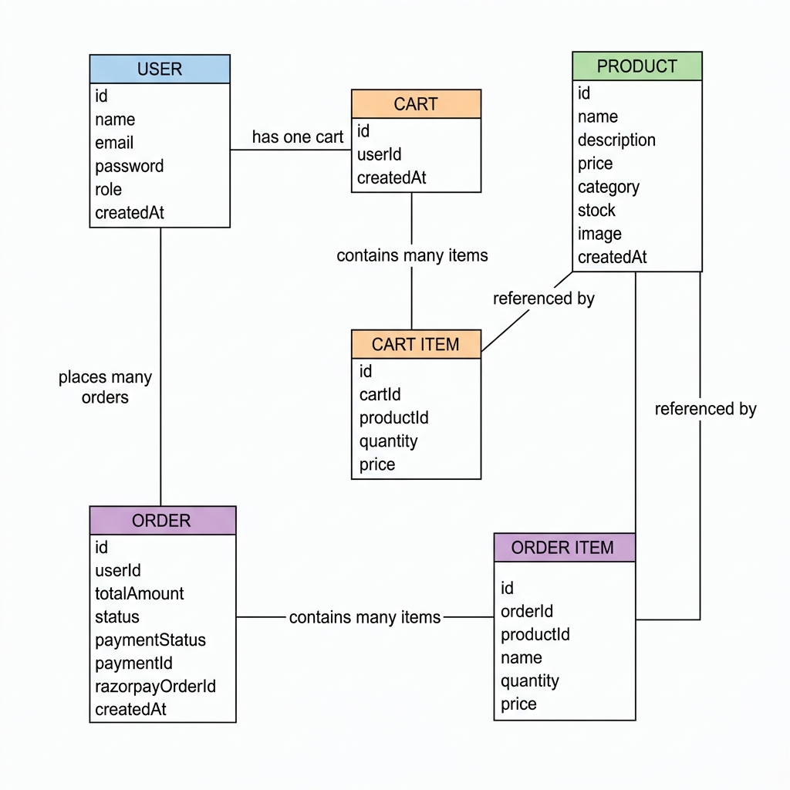

# ER Diagram — Dukaan

This diagram shows all database tables and how they are connected.

## Relationships

| Relationship | Type |
|---|---|
| User has Cart | One to One |
| User places Orders | One to Many |
| Cart has Cart Items | One to Many |
| Order has Order Items | One to Many |
| Product appears in Cart Items | One to Many |
| Product appears in Order Items | One to Many |

## Roles: user, admin
## Categories: Electronics, Grocery, Fashion, Shoes, Furniture, Books
## Order Status: pending, confirmed, shipped, delivered, cancelled
## Payment Status: pending, paid, failed
