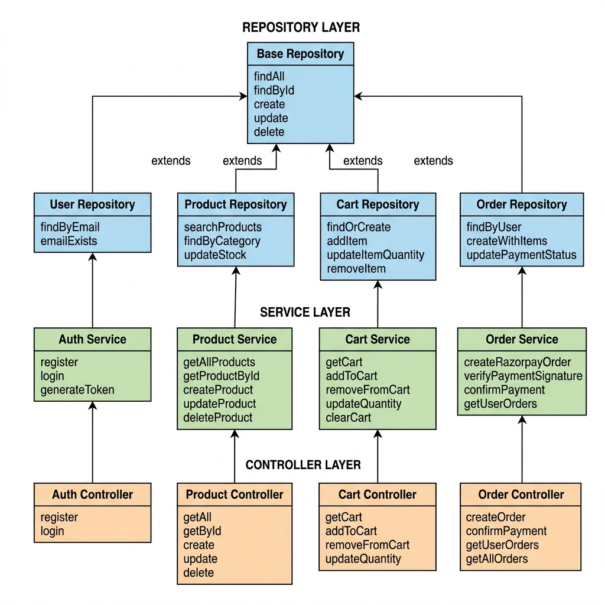

# Class Diagram — Dukaan

This diagram shows how the backend is organized into three layers: Repositories, Services, and Controllers.

## Layer Summary

| Layer | What it does |
|---|---|
| Repository | Directly talks to the database via Prisma |
| Service | Contains business logic and rules |
| Controller | Handles incoming HTTP requests and sends responses |
