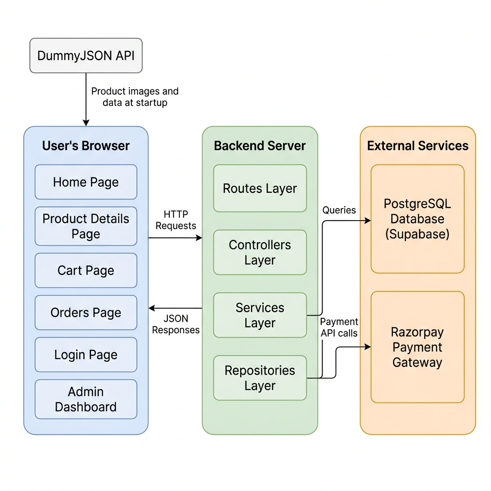

# Project Idea — Dukaan

## What is Dukaan?

Dukaan is an online shopping platform where people can browse products across different categories, add them to a cart, and complete purchases using Razorpay. Think of it as a simplified Amazon or Flipkart built as a learning project.

## System Architecture

## Problem Being Solved

Most e-commerce demos are either too simple with no real functionality or too complex to understand. Dukaan sits in the middle — fully working from login to payment, with clean and readable code.

## Who Uses It

**Shoppers** — Browse, search, and buy products. View past orders.

**Store Admins** — Manage the product catalog. Add, edit, delete products. View all orders.

## Core Features

**For Shoppers**
- Register and log in
- Browse all products or filter by category
- Search by product name
- View product detail page with a real image gallery
- Add to cart, update quantities, remove items
- Pay via Razorpay
- View full order history

**For Admins**
- Admin dashboard with product management
- Add, edit, delete products
- View all orders from all users

## Technology Stack

| Part | Technology |
|---|---|
| Frontend | React, Vite, Tailwind CSS |
| Backend | Node.js, Express |
| Database | PostgreSQL on Supabase |
| ORM | Prisma |
| Auth | JSON Web Tokens |
| Payments | Razorpay |
| Product Data | DummyJSON API for seeding |
