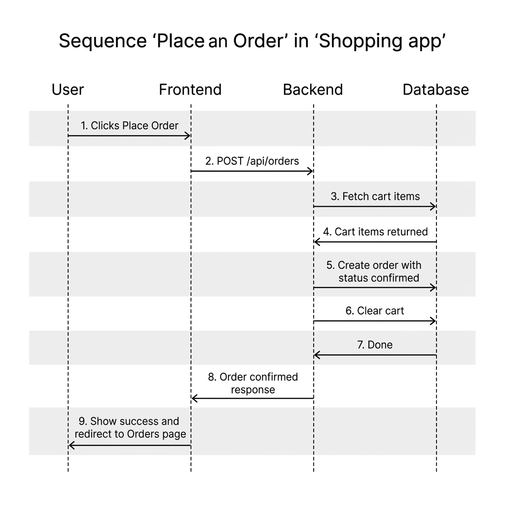

# Sequence Diagram — Dukaan

This diagram shows the step-by-step flow when a user places an order.

## Other Key Flows

**User Registration**
User fills form → Frontend sends to backend → Backend checks email → Saves user → Returns login token → User is logged in

**Adding to Cart**
User clicks Add to Cart → Backend checks login → Finds or creates cart → Adds product → Returns updated cart

**Browsing Products**
User opens home page → Frontend fetches products with optional search or category filter → Backend queries database → Products displayed in grid

**Admin Adding a Product**
Admin fills product form → Frontend sends to backend → Backend verifies admin role → Saves product to database → Product appears in store
