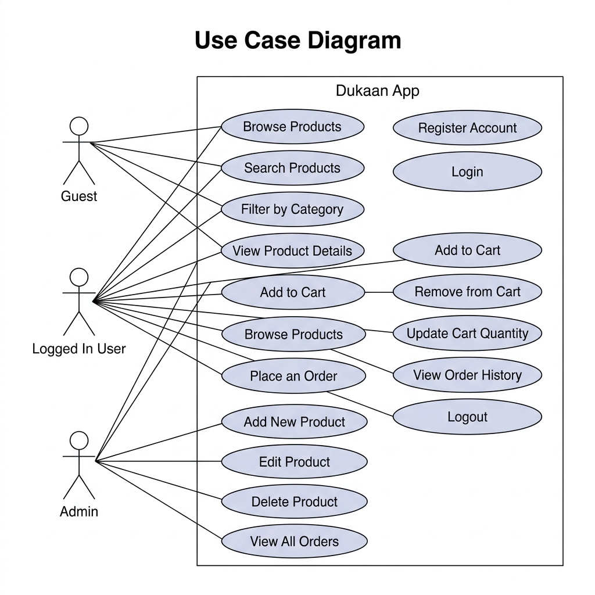

# Use Case Diagram — Dukaan

This diagram shows what each type of user can do in the application.

## Quick Summary

| Action | Guest | User | Admin |
|---|---|---|---|
| Browse and search products | Yes | Yes | Yes |
| View product details | Yes | Yes | Yes |
| Register and Login | Yes | Already done | Already done |
| Manage cart | No | Yes | No |
| Place an order | No | Yes | No |
| View own orders | No | Yes | Yes (all) |
| Add, edit, delete products | No | No | Yes |
